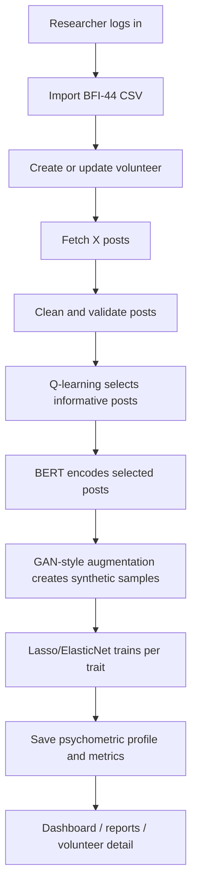

# Personality Prediction App

A Django-based research application for predicting Big Five personality traits from social media text. The current implementation combines BFI-44 survey scoring, X/Twitter post ingestion, Q-learning-based post selection, BERT embeddings, lightweight GAN-style augmentation, and sparse Lasso/ElasticNet regression to produce a personality profile with explainable metrics.

## What the system does

The app supports a full researcher workflow:

1. Authenticate as a researcher.
2. Import BFI-44 survey responses from CSV.
3. Create or link a volunteer profile and fetch posts.
4. Run the ML pipeline to generate personality predictions.
5. Review the results in the dashboard and export insights.

## Current architecture

### Tech stack

- Django 5.x for the application layer
- SQLite for local development and PostgreSQL for production-ready deployments
- Celery + Redis for asynchronous pipeline execution
- PyTorch and Hugging Face Transformers for BERT embeddings
- scikit-learn for Lasso/ElasticNet regression
- HTMX + Tailwind CSS for the UI
- Chart.js for radar-style OCEAN visualizations

### Project structure

```text
backend/
  accounts/        # authentication and profile views
  core/            # models, BFI scoring, shared services
  dashboard/       # researcher dashboard and volunteer detail views
  ml_pipeline/     # preprocessing, Q-learning, BERT, GAN augmentation, Lasso
  public/          # public landing pages and prediction demo
  tools/           # CSV upload, post fetch, pipeline control
  templates/       # Django templates
config/            # Django settings and URLs
manage.py
requirements*.txt
```

## Core data model

The pipeline is built around these domain models:

- VOLUNTEER: the participant profile, consent state, researcher ownership, and pipeline status
- BFI_SURVEY: the ground-truth Big Five Inventory responses and computed trait scores
- POST: posts collected from X/Twitter with engagement metadata and selection flags
- BERT_EMBEDDING: the 768-dimensional contextual embedding stored for each selected post
- Q_LEARNING_LOG: logs of the active selection decisions and learned Q-values
- SYNTHETIC_DATA: GAN-style augmented training samples generated from embeddings
- LASSO_MODEL: one sparse regression model per OCEAN trait
- PSYCHOMETRIC_PROFILE: the final predicted profile, MAE metrics, and confidence values

## Algorithm and model design

The current implementation follows a pragmatic research pipeline rather than a fully production-grade deep learning stack.

### 1. BFI-44 scoring

A survey import is processed through the BFI scorer, which reads the 44 questionnaire items, applies reverse-scoring where required, and calculates the five OCEAN trait scores on a 1-5 scale.

### 2. Input preparation

For each volunteer, the pipeline retrieves posts from the database. If none are present, it attempts a live fetch from the X/Twitter integration. The text is cleaned and filtered before it is used downstream.

### 3. Q-learning post selection

The Q-learning agent turns each post into a simple state representation based on:

- engagement score
- recency
- text length
- hashtags presence
- URL presence

It then selects the most informative posts for the next stage using an epsilon-greedy strategy.

### 4. BERT embedding extraction

The selected posts are encoded with bert-base-uncased. Each post receives a 768-dimensional contextual embedding, which is persisted to the database.

### 5. GAN-style augmentation

The system uses a lightweight augmentation step that perturbs the BERT embeddings with Gaussian noise and generates synthetic text templates. This is implemented as a simplified GAN-style augmentation layer rather than a full adversarial network.

### 6. Lasso / ElasticNet regression

The app trains one sparse regression model per trait using pooled embeddings from labeled volunteers. The training process uses normalized features and produces interpretable coefficients, validation metrics, and trait-level predictions.

### 7. Final personality profile

The orchestrator saves the final predictions in PSYCHOMETRIC_PROFILE and stores per-trait metrics such as MAE, correlation, and R² when enough label data is available.

## End-to-end workflow

### A. Authentication and researcher setup

1. Open the app and sign in or register.
2. The authenticated user becomes the researcher for new volunteers.
3. The dashboard shows volunteer counts, recent activity, and links to tools.

### B. CSV import and BFI survey ingestion

1. Go to the tools page.
2. Upload a CSV containing the BFI-44 survey responses.
3. The uploader reads rows, extracts the volunteer X handle, and checks the informed-consent flag.
4. For each accepted row, a VOLUNTEER record is created or reused.
5. The BFI responses are converted into a BFI_SURVEY object with computed OCEAN scores.

### C. Post collection

1. From the tools page, fetch posts for a volunteer using the X/Twitter integration.
2. The fetched posts are stored as POST rows.
3. The text preprocessor cleans and filters content before it is passed to the ML stages.

### D. Running the pipeline

1. Select a volunteer with a BFI survey and available posts.
2. Start the full pipeline from the tools UI.
3. The request queues a Celery task.
4. The pipeline orchestrator executes the stages in order:
   - input data retrieval
   - Q-learning selection
   - BERT embedding extraction
   - GAN-style augmentation
   - Lasso/ElasticNet prediction
5. Results are persisted to the database and shown on the dashboard.

## Pipeline flowchart



## Running locally

### 1. Create and activate a virtual environment

```bash
python -m venv .venv
source .venv/bin/activate
```

On Windows PowerShell:

```powershell
py -m venv .venv
.\.venv\Scripts\Activate.ps1
```

### 2. Install dependencies

```bash
pip install -r requirements.txt
pip install -r requirements-dev.txt
```

### 3. Apply database migrations

```bash
python manage.py migrate
```

### 4. Create an admin user

```bash
python manage.py createsuperuser
```

### 5. Start the Django app

```bash
python manage.py runserver 8000
```

### 6. Start Celery workers for background pipeline jobs

```bash
celery -A backend.config worker -l info
celery -A backend.config beat -l info
```

## Main user journeys

### Researcher workflow

- Sign in at /accounts/login/
- Open the dashboard at /dashboard/
- Upload CSV data at /tools/csv-upload/
- Fetch posts at /tools/fetch-posts/
- Trigger the pipeline at /tools/run-pipeline/ or the unified tools control surface

### Public demo workflow

- Visit / for the landing page
- Open /live-prediction/ to try the live prediction demo
- Use /api/predict/ for text-based prediction requests

## Notes on the current implementation

- The system is already wired to persist embeddings, synthetic samples, regression models, and psychometric profiles in the database.
- The pipeline is orchestrated by PipelineOrchestrator and executed through Celery tasks.
- The current augmentation layer is a simplified, interpretable implementation of GAN-style data expansion rather than a full generative adversarial network.
- The final profile is designed to be explainable through sparse coefficients, training metrics, and confidence scores.

## Recommended next steps

- Add richer post-level feature engineering for Q-learning rewards.
- Improve the augmentation strategy with stronger synthetic-data validation.
- Add batch CSV import support for larger studies.
- Add export and reporting improvements for dashboards and volunteer comparisons.

## License

Research purposes only. See LICENSE file for details.

## Support

For issues or questions:

1. Check logs in `/logs/`
2. Review admin interface
3. Test ML services in isolation
4. Consult inline code documentation

---

**Built with Django 5.x, PyTorch, and HuggingFace Transformers**
