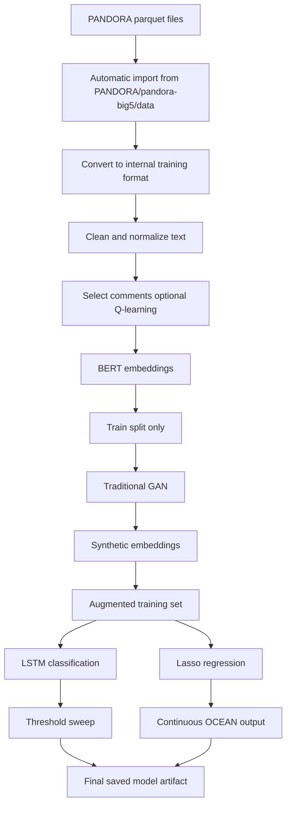

# PANDORA Integration Implementation Plan

## Goal

Complete the switch to PANDORA as the primary training dataset for the social-media personality pipeline while keeping X-handle prediction as the inference path.

The final system should:

- ingest the cloned PANDORA parquet files automatically from the project directory
- convert the parquet shards into the app's internal training format
- split data correctly for training, validation, and testing
- train a real adversarial GAN on training embeddings only
- train LSTM for classification and Lasso for continuous regression
- sweep thresholds and select the best one on validation data
- save a reusable model artifact for later prediction
- update the UI so the new workflow is visible and understandable

## Environment

Use the local virtual environment at:

- `C:/Users/USER/Demola/medv`

When running management commands, tests, or scripts, activate or call that environment explicitly.

Example:

```powershell
C:\Users\USER\Demola\medv\Scripts\python.exe manage.py check
```

## Current PANDORA Source Location

The cloned PANDORA repository already exists inside the project at:

- `C:/Users/USER/Demola/personality-prediction-app/PANDORA`

The parquet files are stored under:

- `C:/Users/USER/Demola/personality-prediction-app/PANDORA/pandora-big5/data/`

Files detected there:

- `train-00000-of-00002.parquet`
- `train-00001-of-00002.parquet`
- `validation-00000-of-00001.parquet`
- `test-00000-of-00001.parquet`

Because the repository is inside the project tree, the backend can auto-discover these files. It does not happen automatically by itself; the code must explicitly scan that directory and load the shards.

## What the Converted PANDORA Data Looks Like

The converted workbook snapshot shows a flattened comment-level structure with columns like:

- `O`
- `C`
- `E`
- `A`
- `N`
- `ptype`
- `text`
- `__index_level_0__`

This means:

- `text` is the model input
- `O/C/E/A/N` are the continuous trait targets
- `ptype` can be kept as a secondary label or metadata field
- `__index_level_0__` should be dropped

If a future raw PANDORA export contains author identifiers, the pipeline can support author-level grouping. For the current cloned parquet files, the safe assumption is that training should be treated as comment-level or sequence-level unless a true author id is confirmed.

## Recommended Data Handling Rules

1. Do not group samples by identical BFI scores.
2. Treat BFI scores as labels, not identity keys.
3. Split by the true unit of analysis:
   - by author if author ids exist
   - by row/comment if author ids do not exist
4. Never let train and test share the same person if person ids are available.
5. Keep validation and test untouched by augmentation.

## Pipeline Overview



## Step 1. Dataset Discovery and Import

### Purpose

Automatically locate and load the parquet shards from the cloned PANDORA repository.

### Behavior

- On train click or dedicated training command, the backend checks:
  - `PANDORA/pandora-big5/data/`
- It loads all `.parquet` shards it finds there.
- It concatenates the shards into one internal dataset.
- It caches or persists the converted dataset so repeated training does not re-import the raw parquet every time.

### Expected code responsibilities

- Add a PANDORA loader module or expand the existing one.
- Use a config value or default path for the dataset directory.
- Drop unused columns.
- Preserve metadata needed for evaluation and UI display.

### Import fallback

If the directory is missing or empty:

- show a clear UI error
- allow a manual path override
- do not start training on partial data

## Step 2. Data Conversion

Convert the raw parquet rows into a consistent internal format such as:

- `source`
- `sample_id`
- `text`
- `traits`
- `ptype`
- `split_hint`

For the current PANDORA clone:

- `text` becomes the raw social-media sample
- `O/C/E/A/N` become regression targets
- `ptype` can be used for auxiliary categorization or analysis

If the original author ids are ever available:

- convert by author
- keep all comments for one author together
- build user-level sequences

## Step 3. Cleaning and Normalization

Use the existing text cleaning layer to:

- remove noise
- normalize whitespace
- filter empty or invalid comments
- prepare text for BERT

Do not duplicate cleaning logic in the PANDORA importer.

## Step 4. Split Strategy

### Primary rule

Split at the correct identity level.

- If author ids exist: split by author
- If author ids do not exist: split by comment row

### Recommended split ratios

- Training: 70-80 percent
- Validation: 10-15 percent
- Test: 10-15 percent

### Rules

- validation is for model selection and threshold tuning
- test is for final reporting only
- no augmentation on validation or test
- no threshold tuning on test

## Step 5. Q-Learning Role

Q-learning should be treated as an optional selection stage.

### Role

- select the most informative comments from a timeline
- reduce redundant posts
- keep the most useful samples for representation learning

### When to use

- when the model receives a timeline of posts/comments per person
- when comment selection improves signal quality

### When to bypass

- when the dataset is already flat comment-level and there is no meaningful sequential context

## Step 6. BERT Role

BERT converts each selected comment into a dense embedding.

### Role

- text -> contextual embedding
- supports both LSTM and Lasso downstream

### Output

- embedding vectors for each sample or sequence item

## Step 7. Traditional GAN Role

Build a complete adversarial GAN, not a simplified noise augmenter.

### Components

- `Generator`
- `Discriminator`
- adversarial training loop
- synthetic embedding generation
- quality checks and diagnostics

### Training rule

- train only on training embeddings
- never use validation or test embeddings

### Output

- synthetic BERT-style embeddings
- optional conditional labels if using cGAN

### Recommendation

Use a conditional GAN if you want to condition on:

- `ptype`
- OCEAN bins
- Low / Medium / High classes

This is preferable if you want the synthetic samples to preserve target structure.

## Step 8. LSTM Role

LSTM is the classification branch.

### Role

- learn sequence patterns from comments or embeddings
- predict personality class output

### Output

- class label
- class probabilities
- accuracy
- precision
- recall
- F1
- specificity
- confusion matrix

### Threshold handling

- evaluate 4 or 5 candidate thresholds on validation data
- choose the best one using the documented criterion, usually F1
- lock the threshold before final test evaluation

## Step 9. Lasso Role

Lasso is the regression and interpretability branch.

### Role

- predict continuous OCEAN scores
- provide sparse coefficients and explainability

### Output

- predicted scores
- MAE
- RMSE
- correlation
- R2
- feature coefficients

## Step 10. Augmentation and Training Order

The correct order is:

1. import and convert PANDORA
2. clean text
3. split data
4. compute BERT embeddings
5. fit GAN on training embeddings only
6. generate synthetic training embeddings
7. train LSTM classifier
8. train Lasso regressor
9. evaluate thresholds and metrics
10. save model artifact

## Step 11. Prediction Flow After Training

After training, the model should support prediction on:

- X handles
- any social-media timeline input
- optionally PANDORA held-out test users for benchmark evaluation

### Prediction sequence

1. fetch or load social-media text
2. clean text
3. create embeddings with BERT
4. pass through trained LSTM for class output
5. pass through trained Lasso for continuous scores
6. compute confidence and metrics if ground truth exists
7. store the result in the psychometric profile

## Step 12. UI Impact

### Training page

Add display blocks for:

- PANDORA dataset status
- detected parquet files
- number of samples imported
- split counts
- GAN status
- LSTM status
- Lasso status
- best threshold
- final model version

### Prediction page

Show:

- source of training data
- whether the saved model is PANDORA-trained
- LSTM class result
- Lasso scores
- confidence
- threshold used

### Dashboard/profile page

Show:

- dataset mode
- split summary
- threshold sweep results
- regression metrics
- classification metrics
- OCEAN radar chart

## Step 13. Storage and Artifact Plan

Persist the following:

- converted PANDORA cache
- split metadata
- GAN diagnostics
- LSTM metrics
- Lasso metrics
- threshold sweep data
- saved cohort or final model artifact

This ensures later prediction runs do not need to retrain unless the user requests it.

## Step 14. Verification Plan

Before marking the integration complete:

- confirm the parquet import works from `PANDORA/pandora-big5/data/`
- confirm the converted cache is created
- confirm the split is correct
- confirm GAN trains only on the train split
- confirm validation/test remain untouched
- confirm LSTM and Lasso both produce outputs
- confirm the UI displays the new pipeline state
- confirm X-handle prediction still works

## Step 15. Implementation Priority

Recommended order:

1. import and conversion
2. split logic
3. GAN replacement with full adversarial training
4. LSTM integration
5. Lasso integration
6. threshold sweep
7. UI updates
8. final prediction wiring
9. verification and reporting

## Summary

The correct PANDORA integration is:

- automatic parquet discovery from the cloned repo
- explicit conversion into internal training records
- split by the real unit of analysis
- true GAN on training embeddings only
- LSTM for class prediction
- Lasso for continuous OCEAN regression
- threshold selection on validation data
- final prediction on X handles or other social-media inputs

This plan keeps the pipeline scientifically correct and consistent with the dataset structure you have in the project.
